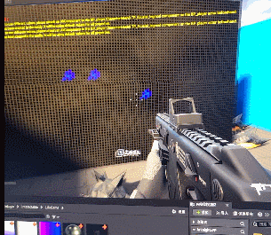
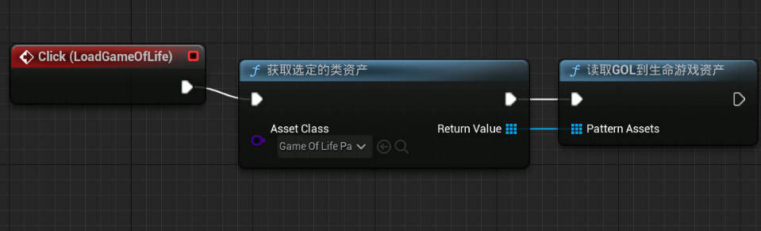
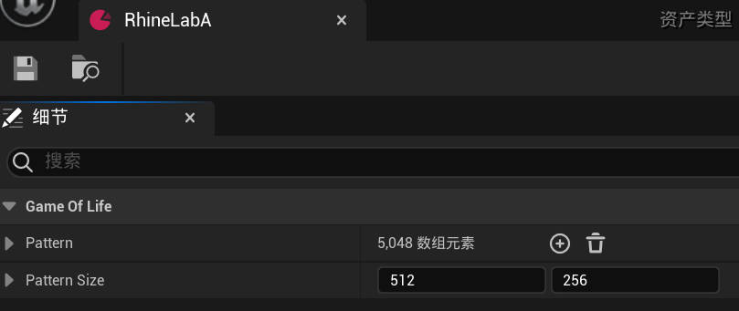
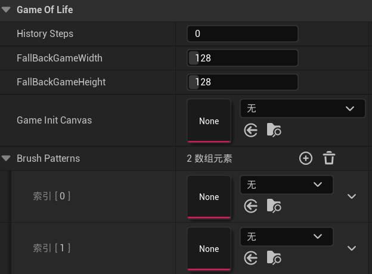
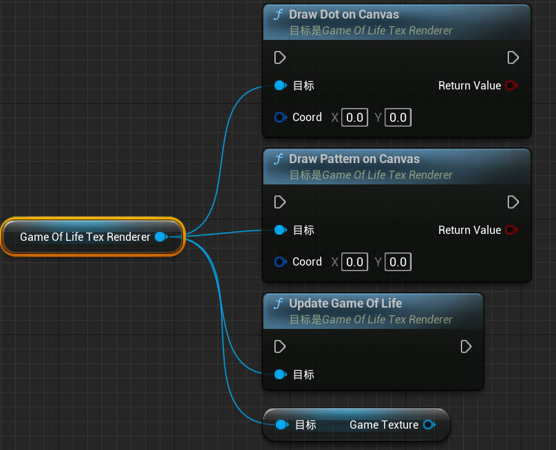

# UE5-GameOfLifeTexRenderer
A UE component that takes hit events and generate interactive Conway's game of life texture.
The component now only supports the classic B3/S23 rule.

### 1. Run that Lua script in Golly to export a custom .gol file

[Golly](https://golly.sourceforge.io/) is an open source, cross-platform application for exploring Conway's Game of Life and many other types of cellular automata. Here you can edit you own Game of Life pattern.

The .gol file is a plain text file which consists of the pattern size and run-length-encoded numbers, storing a game of life pattern.
### 2. Import .gol file as a type of data asset using that editor function
Example:

Run this node to open a file dialog for selection.
This is what a pattern asset looks like:

### 3. Feed those patterns into a GameOfLifeTexRenderer component
Small patterns for drawing brushes, and large patterns for canvas.

History Steps determines how many steps left behind will be displayed.

If you don't fill in the Init Canvas, it generates a blank canvas using the fallback size.

The Brush Pattern will be randomly picked when calling "DrawPatternOnCanvas()". If there's no pattern asset, the default pattern is a glider.

### 4. Launch the GAME OF LIFE!

To display the game of life, get the game texture from the component. The game texture will be updated when Game of Life updates.

To draw on canvas, call the two drawing node. Dot drawing inverts a cell, and pattern drawing uses "AND" logic.

To tick the Game of Life, call the update function manually.

### P.S.

I haven't  make it a plugin yet, so you shall integrate the code yourself : )